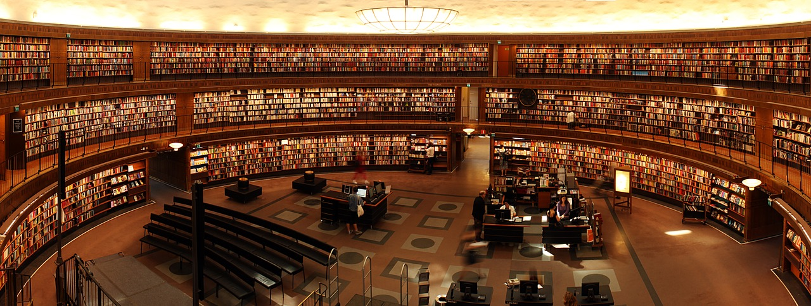

## 1. 책읽기로 결심

대학교를 졸업하고 책을 제대로 본적이 없는 것 같다.
학교를 다닐땐 도서관에도 많이 가고, 도서관에선 공부외에 모든 딴 짓이 다 재밌었기에 책도 봤다. 물론 생각할 시간도 많았고, 도서관 뿐 아니라, 서점에 가는 것도 좋아했다.
회사를 다니며 독서는 사치에 불가하다는것을 깨달았고, 책을 읽지 않고 회사생활하며 점점 생각의 근육이 약해지고 있었음을 알면서도 방치했다.

> 이번 블로그를 시작한 걸 계기로 느리겠지만, 책을 읽기로 결심했다.(~~진지~~) 지식이 아닌, 생각의 깊이를 깊게 하고싶어 시작하는 목표인 만큼 크게 부담갖지 않고 변화해가는 나를 채찍질하려 한다.

## 2. 책 읽기 계획

시작은 일주일에 한권인데 실상 한달에 두권만 읽어도 많이 읽는게 아닐까 싶다. 지금 생각엔... 한달에 2권이라고 해도 일년에 24권밖에 못읽는구나.
**100권+ 100권** 이라 총 8년 은 걸리는 긴 프로젝트가 될것 같다.
그래도 시도해보기로 결심했다.
그래도 몇권은 읽은게 있으니까!

앞으로 읽게 된 책은 이곳에 짧게나마 글을 남기려고 한다.

>_이런 도서관이 있었다면 공부를 더 열심히 했을까_

## 3. 책 리스트

### 1. 1차 추천도서 리스트 100권

| 연번     | 도서명                         | 저자          | 비고  |
| ------ | --------------------------- | ----------- | --- |
| 1      | 구운몽                         | 김만중         |     |
| 2      | 열하일기                        | 박지원         |     |
| 3      | 세계민담전집1:한국편                 | 신동흔 편       |     |
| 4      | 삼대                          | 염상섭         |     |
| 5      | 인간문제                        | 강경애         |     |
| 6      | 태평천하                        | 채만식         |     |
| 7      | 정지용시전집                      | 정지용         |     |
| 8      | 회색인                         | 최인훈         |     |
| 9      | 김수영시전집                      | 김수영         |     |
| 10     | 당신들의 천국                     | 이청준         |     |
| 11     | 난장이가 쏘아올린 작은 공              | 조세희         |     |
| 12     | 산해경                         |             |     |
| 13     | 당시선                         |             |     |
| 14     | 홍루몽                         | 조설근         |     |
| 15     | 기탄잘리                        | 타고르         |     |
| 16     | 루쉰소설집                       | 루쉰          |     |
| 17     | 설국                          | 가와바타 야스나리   |     |
| 18     | 사육                          | 오에 겐자부로     |     |
| 19     | 변신인형                        | 왕멍          |     |
| 20     | 일리아스/오뒷세이아                  | 호메로스        |     |
| 21     | 희랍비극                        | 아이스킬로스 외    |     |
| 22     | 변신                          | 오비디우스       |     |
| 23     | 햄릿                          | 셰익스피어       |     |
| 24     | 돈키호테                        | 세르반테스       |     |
| 25     | 실락원                         | 밀턴          |     |
| 26     | 파우스트                        | 괴테          |     |
| 27     | 포 단편집                       | 에드거 앨런 포    |     |
| 28     | 백경                          | 멜빌          |     |
| 29     | 악의 꽃                        | 보들레르        |     |
| 30     | 보바리 부인                      | 플로베르        |     |
| 31     | 사일러스 마너                     | 조지 엘리엇      |     |
| 32     | 위대한 유산                      | 찰스 디킨스      |     |
| 33     | 안나 카레니나                     | 톨스토이        |     |
| 34     | 인형의 집                       | 입센          |     |
| 35     | 카라마조프가의 형제들                 | 도스토예프스키     |     |
| 36     | 말테의 수기                      | 릴케          |     |
| 37     | 스완네 집 쪽으로(잃어버린 시간을 찾아서 1부)  | 마르셀 프루스트    |     |
| 38     | 더블린 사람들                     | 제임스 조이스     |     |
| 39     | 스무 편의 사랑의 시와 한 편의 절망의 노래    | 파블로 네루다     |     |
| 40     | 황무지                         | T.S 엘리엇     |     |
| 41     | 마의 산                        | 토마스 만       |     |
| 42     | 소송/성                        | 카프카         |     |
| 43     | 자기만의 방                      | 버지니아 울프     |     |
| 44     | 분노의 포도                      | 존 스타인벡      |     |
| 45     | 이방인                         | 카뮈          |     |
| 46     | 독사를 죽였어야 했는데                | 야사르 케말      |     |
| 47     | 불한당들의 세계사                   | 보르헤스        |     |
| 48     | 닥터 지바고                      | 빠스제르낙       |     |
| 49     | 양철북                         | 귄터 그라스      |     |
| 50     | 백년의 고독                      | 마르케스        |     |
| 51     | 장미의 이름                      | 움베르토 에코     |     |
| 52     | 참을 수 없는 존재의 가벼움             | 밀란 쿤데라      |     |
| 인문·사회  |                             |             |     |
| 53     | 논어                          | 공자          |     |
| 54     | 도덕경                         | 노자          |     |
| 55     | 아함경                         | 석가세존        |     |
| 56     | 소크라테스의 변론                   | 플라톤         |     |
| 57     | 니코마코스 윤리학                   | 아리스토텔레스     |     |
| 58     | 맹자                          | 맹자          |     |
| 59     | 장자                          | 장자          |     |
| 60     | 사기                          | 사마천         |     |
| 61     | 의무론                         | 키케로         |     |
| 62     | 성경                          |             |     |
| 63     | 명상록                         | 아우렐리우스      |     |
| 64     | 고백록                         | 아우구스티누스     |     |
| 65     | 꾸란                          |             |     |
| 66     | 삼국유사                        | 일연          |     |
| 67     | 우신예찬                        | 에라스무스       |     |
| 68     | 유토피아                        | 토마스 모어      |     |
| 69     | 그리스도인의 자유                   | 루터          |     |
| 70     | 성학십도                        | 이황          |     |
| 71     | 신기관                         | 프랜시스 베이컨    |     |
| 72     | 방법서설                        | 르네 데카르트     |     |
| 73     | 팡세                          | 파스칼         |     |
| 74     | 국부론                         | 아담 스미스      |     |
| 75     | 도덕의 계보                      | 니체          |     |
| 76     | 프로테스탄트 윤리와 자본주의 정신          | 막스 베버       |     |
| 77     | 쾌락원칙을 넘어서                   | 지그문트 프로이트   |     |
| 78     | 호모 루덴스                      | 요한 하이징아     |     |
| 79     | 자유로부터의 도피                   | 에리히 프롬      |     |
| 80     | 국화와 칼                       | 루스 베네딕트     |     |
| 81     | 죽음의 수용소에서                   | 빅터 프랭클      |     |
| 82     | 서양미술사                       | 곰브리치        |     |
| 83     | 옥중서간                        | 본회퍼         |     |
| 84     | 역사란 무엇인가                    | E.H.카아      |     |
| 85     | 대지의 저주받는 사람들                | 프란츠 파농      |     |
| 과학·기술  |                             |             |     |
| 86     | 침묵의 봄                       | 레이첼 카슨      |     |
| 87     | 부분과 전체                      | 하이젠베르크      |     |
| 88     | 사상사 속의 과학                   | 히로시게 토오루 외  |     |
| 89     | 최초의 3분                      | 와인버그        |     |
| 90     | 생명의 느낌                      | 이블린 폭스 켈러   |     |
| 91     | 카오스                         | 제임스 글릭      |     |
| 92     | 천재, 리처드 파인만의 삶과 과학          | 제임스 글릭      |     |
| 93     | 디지털이다                       | 네그로폰테       |     |
| 94     | 우리 수학자 모두는 약간 미친 겁니다        | 폴 호프먼       |     |
| 95     | 아톰으로 이루어진 세상                | 라이너 그리스하머   |     |
| 96     | 과학이 종교를 만날 때                | 이언 바버       |     |
| 97     | 게놈                          | 매트 리들리      |     |
| 98     | 정재승의 과학 콘서트                 | 정재승         |     |
| 99     | 20세기를 만든 아름다운 방정식들          | 그레이엄 파멜로 외  |     |
| 100    | 거의 모든 것의 역사                 | 빌 브라이슨      |     |

### 2. 2차 추천도서 100권 리스트

| 연번     | 도서명                  | 저자             | 비고
| ------ | -------------------- | -------------- |----
| 1      | 가르강튀아 팡타그뤼엘          | 라블레            |
| 2      | 고도를 기다리며             | 베케트            |
| 3      | 고향                   | 이기영            |
| 4      | 관촌수필                 | 이문구            |
| 5      | 금오신화                 | 김시습            |
| 6      | 데카메론                 | 복카치오           |
| 7      | 도리언그레이의 초상           | 와일드            |
| 8      | 드리나강의 다리             | 이보 안드리치        |
| 9      | 매천야록                 | 황현             |
| 10     | 주홍글씨                 | 호손             |
| 11     | 사람아 아, 사람아!          | 다이오우잉          |
| 12     | 신곡                   | 단테             |
| 13     | 아이네이스                | 베르길리우스         |
| 14     | 유리알 유희               | 헤세             |
| 15     | 음향과 분노               | 윌리암 포크너        |
| 16     | 이반 데니소비치의 하루         | 솔제니친           |
| 17     | 인간조건                 | 말로             |
| 18     | 고리오영감                | 발자크            |
| 19     | 장 크리스토프              | 롤랑             |
| 20     | 죽음의 한 연구             | 박상륭            |
| 21     | 천변풍경                 | 박태원            |
| 22     | 바람의 넋                | 오정희            |
| 23     | 트리스트럼 샌디             | 로렌스 스턴         |
| 24     | 페테르부르크               | 안드레이 벨르이       |
| 25     | 폭풍의 언덕               | 브론테            |
| 26     | 피의 꽃잎                | 은구기 와 시옹고      |
| 27     | 하인리히 폰 오프딩겐(푸른 꽃)    | 노발리스           |
| 28     | 한중록                  | 혜경궁 홍씨         |
| 29     | 허삼관 매혈기              | 여화             |
| 인문·사회  |                      |                |
| 30     | 감시와 처벌               | 미셀 푸코          |
| 31     | 경제발전의 이론             | 죠셉 슘페터         |
| 32     | 계몽의 변증법              | 아도르노/호르크하이머    |
| 33     | 공포와 전율               | 키에르케고어         |
| 34     | 국가                   | 플라톤            |
| 35     | 근사록                  | 주희             |
| 36     | 대동서                  | 강유위            |
| 37     | 도덕적 인간과 비도덕적 사회      | 니버             |
| 38     | 도덕형이상학 기초            | 칸트             |
| 39     | 동경대전                 | 최제우            |
| 40     | 목민심서                 | 정약용            |
| 41     | 리바이어던                | 홉스             |
| 42     | 명이대방록                | 황종희            |
| 43     | 문명화의 과정              | 엘리아스           |
| 44     | 문학과 예술의 사회사          | 아놀드 하우저        |
| 45     | 물질문명과 자본주의           | 페르낭 브로델        |
| 46     | 미국의 민주주의             | 토크빌            |
| 47     | 미디어의 이해              | 마셜 맥루한         |
| 48     | 블루오션 전략              | 김위찬            |
| 49     | 불평등기원론               | 루소             |
| 50     | 선가귀감                 | 서산대사           |
| 51     | 선택할 자유               | 밀턴 프리드만        |
| 52     | 설득의 심리학              | 로버트 치알디니       |
| 53     | 성과 속                 | 엘리아데           |
| 54     | 세속의 철학자들             | 헤일브로너          |
| 55     | 시간과 타자               | 레비나스           |
| 56     | 시학                   | 아리스토텔레스        |
| 57     | 신화의 힘                | 조셉 켐벨          |
| 58     | 언어에 대한 지식            | 노엄 촘스키         |
| 59     | 여성의 역사               | 조르주 뒤비, 미셀 페로  |
| 60     | 역사연구                 | 토인비            |
| 61     | 열린사회와 그 적들           | 칼 포퍼           |
| 62     | 예종에의 길               | 하이에크           |
| 63     | 오리엔탈리즘               | 에드워드 사이드       |
| 64     | 옥중수고                 | 그람씨            |
| 65     | 우주에서의 인간의 지위         | 막스 셸러          |
| 66     | 육조단경                 | 혜능             |
| 67     | 이탈리아 르네상스의 문화        | 부르크하르트         |
| 68     | 인간의 조건               | 한나 아렌트         |
| 69     | 자본주의 정신과 반자본주의 심리    | 미제스            |
| 70     | 자유론                  | J.S.밀          |
| 71     | 전습록                  | 왕양명            |
| 72     | 정의론                  | 존 롤스           |
| 73     | 제2의 성                | 보부와르           |
| 74     | 존재와 시간               | 하이데거           |
| 75     | 좋은 기업을 넘어 위대한 기업으로   | 짐 콜린스          |
| 76     | 종교의 의미와 목적           | 일프레드 캔트웰 스미스   |
| 77     | 죽은 경제학자들의 살아있는 아이디어  | 부크홀츠           |
| 78     | 중국 고대사상의 세계          | 벤자민 슈워츠        |
| 79     | 중국 근대 종교윤리와 상인정신     | 여영서            |
| 80     | 중용                   | 자사             |
| 81     | 징비록                  | 유성룡            |
| 82     | 천주실의                 | 마테오 리치         |
| 83     | 철학의 위안               | 보에티우스          |
| 84     | 충성과 반역               | 마루야마 마사오       |
| 85     | 프로페셔널의 조건            | 피터 드러커         |
| 과학·기술  |                      |                |
| 86     | 21세기 컴퓨터학            | 사카무라 겐         |
| 87     | 가이아 : 생명체로서의 지구      | J. E. 러브룩      |
| 88     | 놀랄만한 수학 아이디어와 문제들    | 맬컴 E. 라인스      |
| 89     | 누가 소프트웨어의 심장을 만들었는가  | 박지훈            |
| 90     | 생명이란 무엇인가?           | 린 마굴리스 외       |
| 91     | 섹스란 무엇인가?            | 린 마굴리스 외       |
| 92     | 신과학 산책               | 김재희            |
| 93     | 엔트로피                 | 리프킨            |
| 94     | 엘러건트 유니버스            | 브라이언 그린        |
| 95     | 우연과 필연               | 장 자크 모노        |
| 96     | 이중나선                 | J D 왓트슨        |
| 97     | 종의 기원                | 다윈             |
| 98     | 테크노폴리                | 닐 포스트만         |
| 99     | 프린키피아                | 뉴턴             |
| 100    | 호두껍질 속의 우주           | 스티븐 호킹         |

## 4. 마치며

어떻게 될지 모르겠지만, 나중에 이책들을 가급적 많이 읽고 나의 생각의 깊이도 깊어졌으면 좋겠다.
