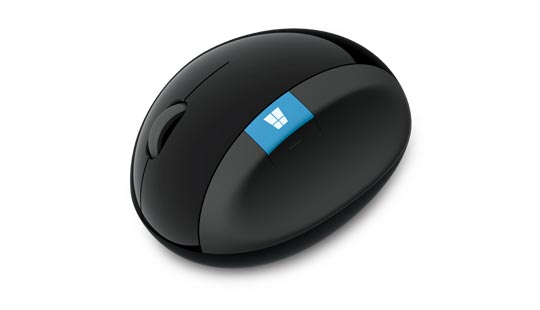

## 마이크로소프트 마우스는 3년되기전에 꼭 교환받으세요

고객센터에 전화해서 바코드 밑에 시리얼넘버를 불러주면 언제 구입했는지 알수 있습니다. 이 날짜를 기억해서 꼭 3년 이전에 교환해두는게 좋습니다.

3년이 지나면 공식센터에서 유/무상 서비스가 모두 불가하므로 서비스를 받아두시는것이 좋습니다.

>스컬프트 인체공학 마우스
도움이 필요하십니까?
아래 유용한 자료를 참조하여 제품 지원을 확인할 수 있습니다.
하드웨어 지원 >
문의처 (고객 지원 센터 : 1577-9700)

1577-9700에 전화해서 접수하시면 됩니다.

3년 이내에는 증상에 상관없이 100% 교환되므로 조금이라도 문제가 있으면 교환 받아두세요

!(https://www.microsoft.com/accessories/ko-kr/products/mice/sculpt-ergonomic-mouse/l6v-00006#techspecs-connect)
