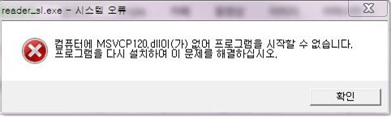
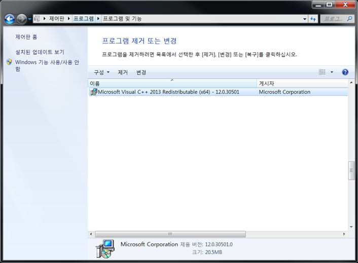
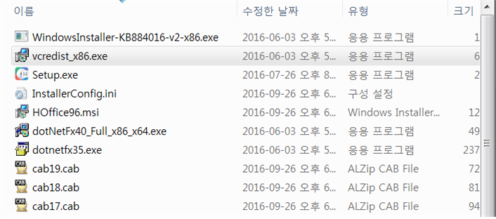

한글과컴퓨터 잘 사용하고계시죠
갑자기 실행이 안될때 해결하는 방법입니다.

<원인>

OS에 visual c++ 2013이 설치되어 있지 않은 상태로 한컴오피스 구동에 필요한 visual c++ 2013을 설치하면 문제 해결 가능

<해결방법>

## 1. CD/ DVD 나 다운로드 설치 경로에 있는 한글 설치 파일 > INSTALL 폴더 > vcredist_x86.exe 실행하여 설치

1) 제어판 > 프로그램 및 기능 실행

2) Microsoft Visual C++ 2013 Redistributable (x86) 삭제

* 단, 삭제 후 해당 항목에 연동된 타 프로그램이 정상 동작을 하지 않을 수 있습니다.

3) PC 재부팅

4) 설치미디어 삽입 > 윈도우 탐색기 > HancomOffice_NEO > INSTALL 폴더 > vcredist_x86.exe 실행하여 설치

 ## 2. Microsoft 홈페이지에서 다운로드 하여 설치

  2014 이하제품 : https://www.microsoft.com/ko-kr/download/confirmation.aspx?id=29
  NEO : https://www.microsoft.com/ko-kr/download/details.aspx?id=40784

<출처>한글과컴퓨터 사이트

